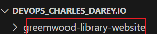
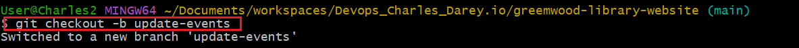

# Enhancing Greenwood Community library website.
This project is about simulating branching and merging on git/gitup using greenwood community libraby website as a case study.
## Repository was created from gitup
## Creating the main branch
- Cloning of repository to the local machine using `git clone` syntax

- Change the VS code using `code .` syntax.

- greenwood library website folder was created on vscode.

- creating html files for the website on vscode.

- change directory to greenwood-library and list the files using `cd` and `ls` syntax respectively.

- Add all created files to remote repository using `git add .` synatx.

- check the git status

- commit all added files

- Push all added files.

## Creating and switching to branch for Morgan (book_review)
- create and switch to 'add-book-review' branch.

- Check if the branch have been created

- Add content to book_review.html

- stage the updated book review

- Commit the updated book review

- Push the updated book review

- Switch back to main branch

- Pull from branch to main

## Creating and switching to update event branch for Jamie's
- create and switch to 'update-events-branch' branch.

- Add the new events to the html files.

- Add the new update-events to remote repository.

- Commit new update to remote repository.

- Update the branch

- Create pull request for Jamie's

- Switch back to main branch

- pull change from updated branch to main
